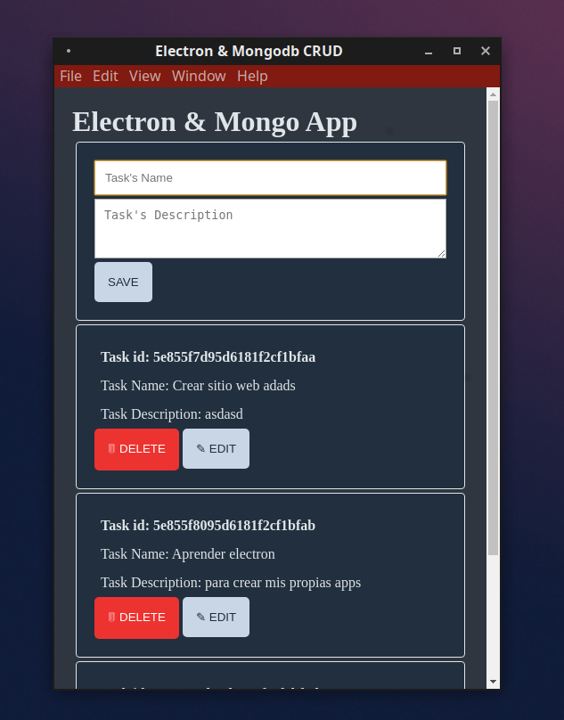

## Electron Mongodb CRUD

A desktop app to take notes using Electron.js, and Mongodb as database.



### Requeriments

- Nodejs
- Mongodb (local or remote installation)

### Environment variables

```
MONGODB_URI
```

## Installation

```bash
npm i
npm start
```
